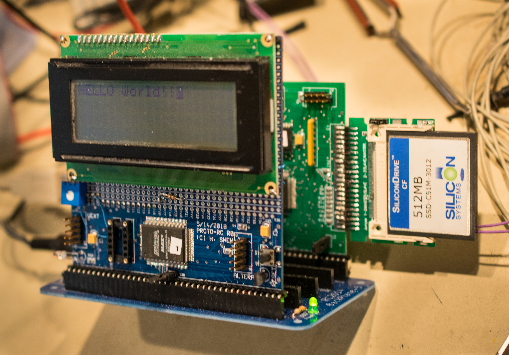
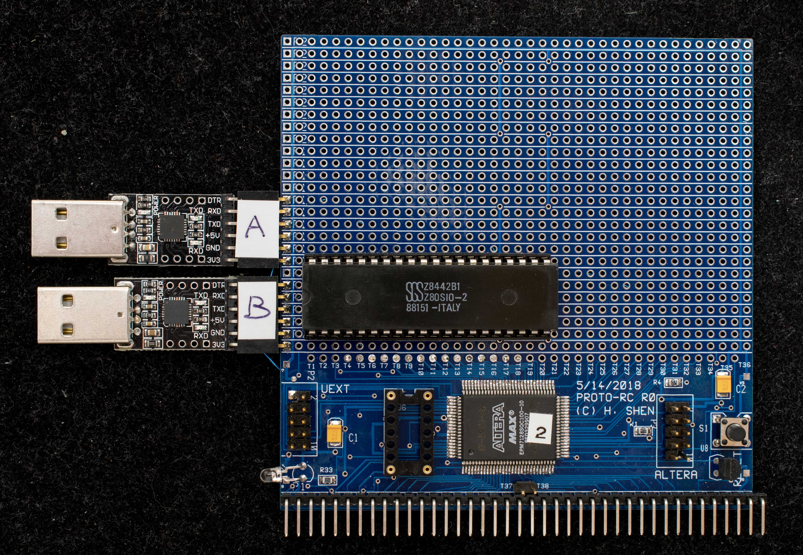
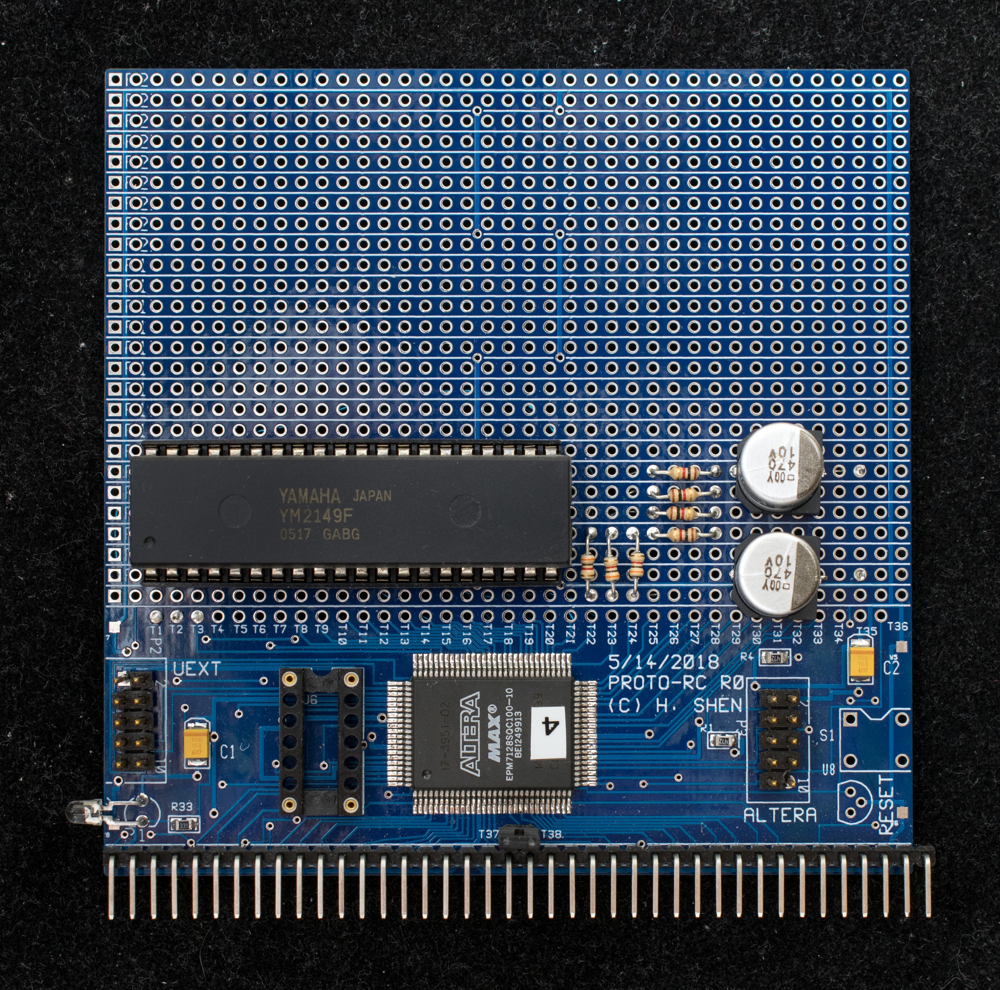

# Projects based on ProtoRC Rev0 board
## ProtoLCD

4x20 LCD display
* Schematic
* CPLD equations

[Component side](DSC_36590528.jpg) picture
***
## ProtoSerial
Serial port in the EPM7128 CPLD
* Schematic
* CPLD equations
***
## ProtoSIO2
Zilog SIO2 on the ProtoPC board
* [Schematic](ProtoSIO2_scm.jpg)
* CPLD equations

***
## ProtoSIO2+I2C
Zilog SIO2 plus I2C controller and test circuit
* [Schematic](ProtoSIO_I2C_test_scm.jpg)
* CPLD equations

ProtoSerial [solder side](DSC_36640601.jpg) picture
***
## ProtoSound
Yamaha YM2149F sound chip on the ProtoRC board
* [Schematic](ProtoSound_scm.jpg)
  - [YM2149](ProtoSound_YM2149_scm.jpg) connection
* CPLD equations

ProtoSound [solder side](DSC_39650925.jpg) picture
