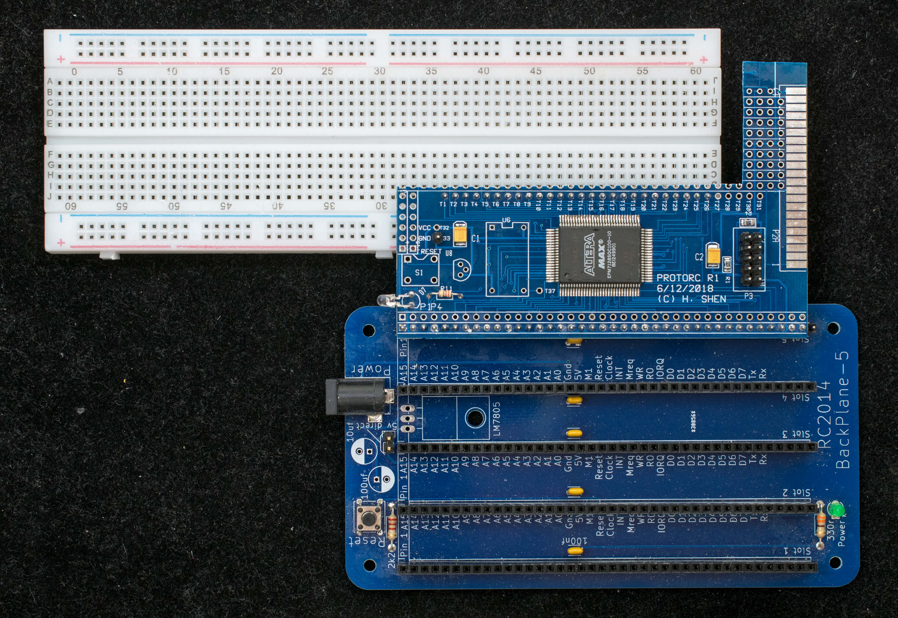
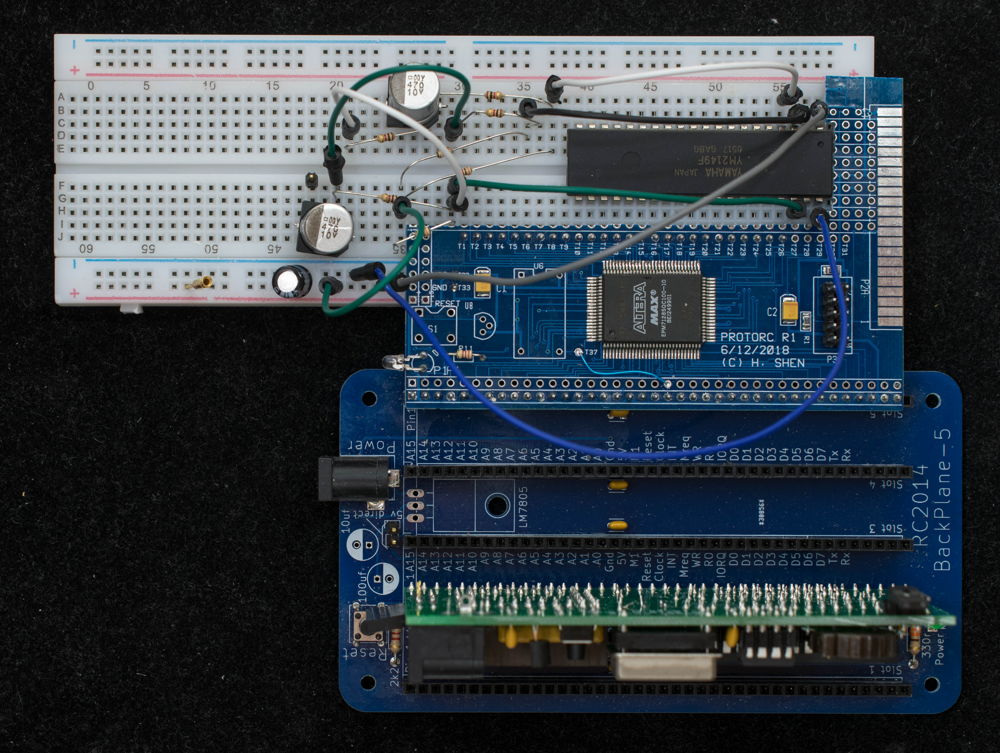
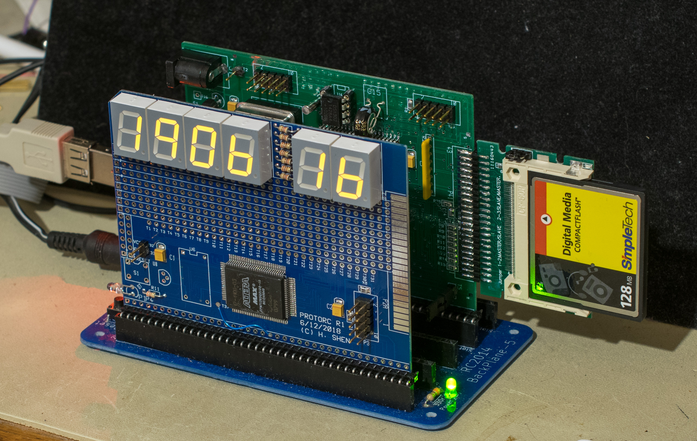
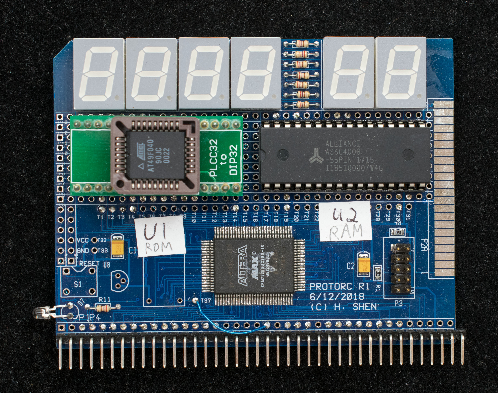
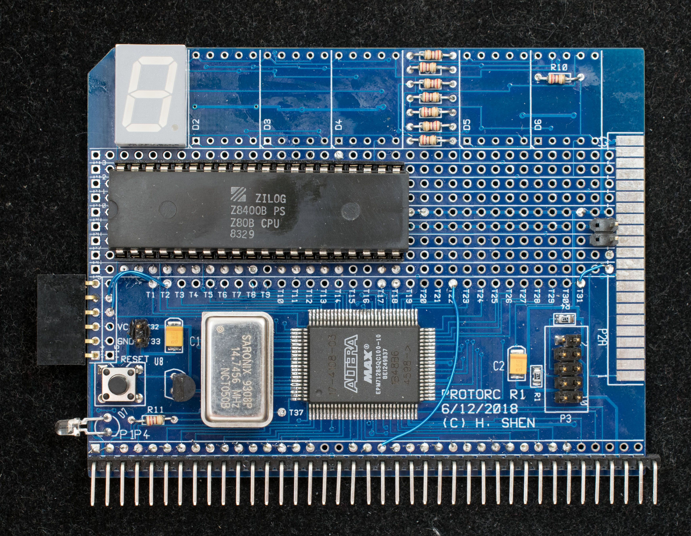
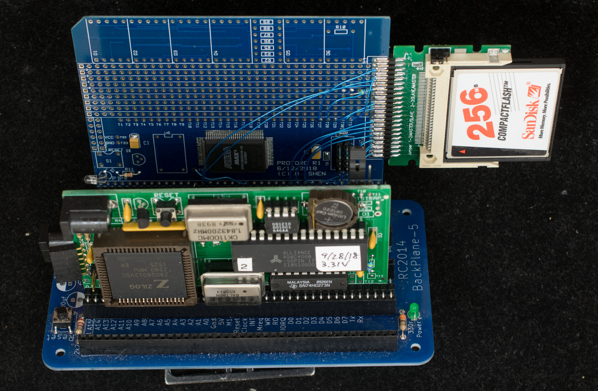

# Projects based on ProtoRC Rev1 board
## ProtoBridge

Bridge from RC2014 backplane to solderless breadboard
* Schematic
* CPLD equations
***
## BridgeSound

Sound chip on solderless breadboard connected to RC2014 via ProtoBridge
* [Schematic](BridgeSound_scm.jpg)
* CPLD equations
***
## Proto7seg

Seven-Segment displays on rev 1 ProtoRC board
* [Schematic](Proto7seg_scm.jpg)
* [CPLD equations](proto7seg_release.zip)
  - CPLD [schematic](Proto7seg_top_scm.pdf)
***
## ProtoMem
512KROM_512KRAM on ProtoRC board
* [Schematic](ProtoMem_scm.jpg)
* CPLD equations

ProtoMem [solder side](DSC_39650926.jpg) pic
***
## ProtoSerial
Serial port implemented in EPM7128
* Schematic
* CPLD equations
***
## ProtoZ80
Z80 on ProtoRC board
* [Schematic](ProtoZ80_scm.jpg)
* CPLD equations

ProtoZ80 [solder side](DSC_37150716.jpg) pic
***
## ProtoSD
Interface to SD card
* Schematic
* CPLD equations
***
## ProtoCF

Compact Flash card interface on ProtoRC board
* [Schematic](ProtoCF_scm.jpg)
* CPLD equations

ProtoCF [component side](DSC_39951002.jpg) pic

ProtoCF [solder side](DSC_39961002.jpg) pic
