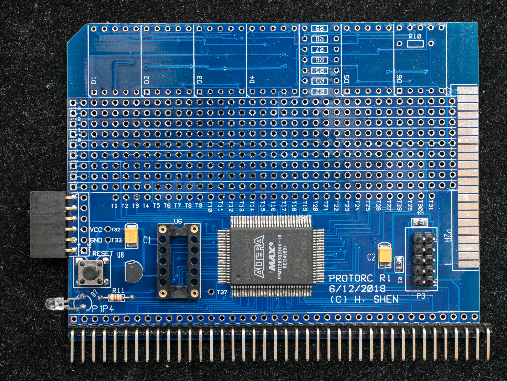

# ProtoRC
Prototype board for [RC2014](http://rc2014.co.uk/).  There are three versions of the board:
## Rev 0
ProtoRC (Prototype for RC2014) is a 100mm x 100mm perf board with an Altera EPM7128 CPLD prewired to a RC2014 bus. The 5V programmable logic is flexible and has sufficient logic to handle a varieties of designs. Beside the CPLD, there is socket for an optional oscillator, an UEXT connector, LED indicator, RESET button, and RESET supervisor.  While some of the support components are surface-mount devices, the prototype area is designed for through-hole devices. 
* Rev 0 [Schematic](protorc_scm.pdf)
* Rev 0 Gerber [Photoplots](PROTORC_r0.zip)
* Rev 0 Bill of Materials
* Rev 0 [CPLD design template](ProtoRC_r0_template.zip)

[Projects](ProtoRC_Rev0_Projects/readme.md) based on Rev 0 ProtoRC

[Rev 0 ProtoRC solder side](DSC_36510526.jpg)

***
## Rev 1
Reduce the board height to 76mm so it is more stable.  Add dedicated 7-segment display circuitry.  Add CF interface and connected pads for DIP packages.
* Rev 1 [Schematic](protoRC_r1_scm.pdf)
* Rev 1 Gerber [Photoplots](ProtoRC1.zip)
* Rev 1 Bill of Materials
* Rev 1 [CPLD design template](ProtoRC_r1_template.zip)

[Projects](ProtoRC_Rev1_Projects/readme.md) based on Rev 1 ProtoRC

[Rev 1 ProtoRC solder side](DSC_40091024.jpg)

***
## Rev 2
Minor modification to Rev 1 board.  Adding 4x20 LCD mounting holes and connector
* Rev 2 [Schematic](ProtoRC_rev2_scm.pdf)
* Rev 2 Gerber Photoplots <- **Do not use, artwork has errors**
* Rev 2 Bill of Materials
* Rev 2 CPLD design template

Projects based on Rev 2 ProtoRC

